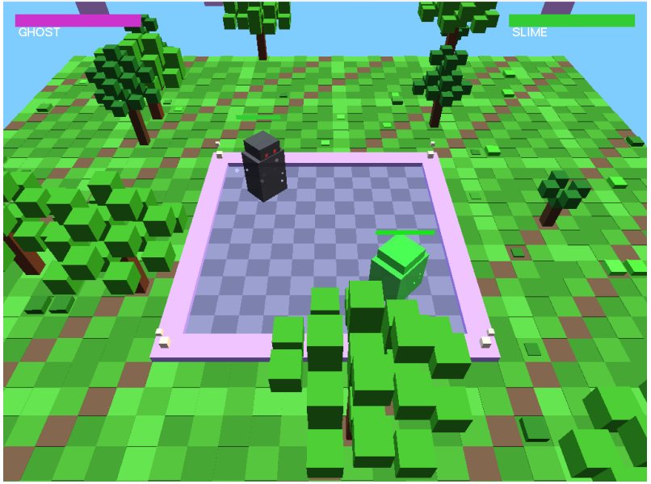

# 🎮 Blind Box Battle Arena

### 📘 Course Project: TCG6223-COMPUTER GRAPHICS

[](https://cplusplus.com/)
[](https://www.opengl.org/)
[]()

## ⚔️ Project Overview
**Blind Box Battle Arena** is an action-packed 2D multiplayer platform fighter developed entirely in C++ using OpenGL. Drawing inspiration from fast-paced brawlers like Smash Bros., players duel in engaging, enclosed dynamic arenas. The project extensively explores principles of low-level 2D graphics programming, precise collision detection, and physics-based fluid character movement.

## 🎯 Key Features
*   **Custom Physics Engine:** Precise AABB (Axis-Aligned Bounding Box) collision detection and fluid gravity-based jumping algorithms.
*   **Dynamic OpenGL Rendering:** Immediate mode graphics plotting sprites, terrain, and hitboxes to the screen buffer.
*   **Local Multiplayer:** Shared keyboard input mapping allowing two players to duke it out simultaneously.
*   **Health & State Management:** Dynamic HP bars, respawn systems, and win-state tracking.

## 🖥️ Tech Stack
*   **Language:** C++
*   **Graphics Library:** OpenGL (Glut / FreeGlut)
*   **Paradigm:** Object-Oriented / Game Loop Architecture

## 📷 Screenshots


*Figure 1: High-octane arena gameplay showcasing platforming, sprites, and the hit-detection system.*

## 📂 Project Structure
```text
TCG6223-COMPUTER_GRAPHICS/
├── Program 1A-Ninja/     # Core Source Code (.cpp, .h) & Shaders
├── bin/                  # Compiled game executable
└── assets/               # Screenshots, sprites, and media
```

## ⚙️ Installation & Setup
1. Clone this repository locally.
2. Ensure you have a C++ IDE (like CodeBlocks or Visual Studio) configured with **Glut** / **FreeGlut**.
3. Link the required libraries (`opengl32`, `glu32`, `freeglut`) in your compiler settings.

## 🕹️ How to Play
1. Open the project workspace in your C++ IDE.
2. Build the project.
3. Run the executable. Player 1 utilizes `W/A/S/D` for movement, while Player 2 utilizes the `Arrow Keys`.
